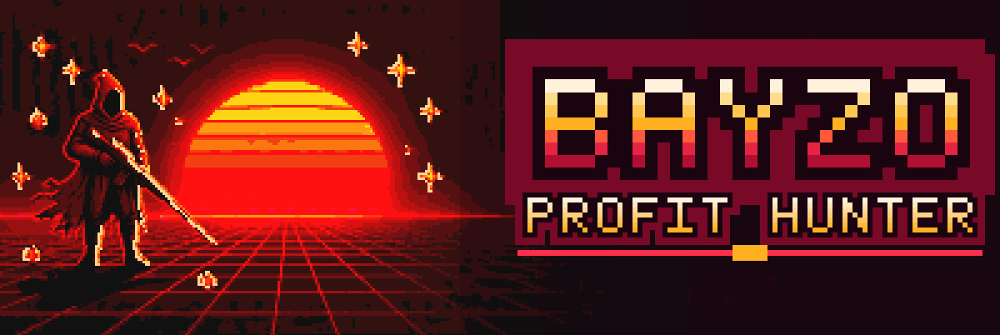

  

  

**On-chain automation** from Indonesia 🇮🇩

I build the scripts, bots and infrastructure all with agents, then keep running
long after I close the laptop.

  
  
  

 

## The ops

Three jobs, one operator. Every script here exists because something had to
happen on a clock.

| | op | what it does |
|:--:|:--|:--|
| ⚡ | **Mint execution** | Pre-signed transactions and multi-RPC broadcast — the race is won before the window opens, not after |
| 🎯 | **Whitelist pipelines** | Mass apply across a wallet pool with sticky-proxy discipline and honest state tracking — no double submits, no silent failures |
| 🛰️ | **Keepalive &amp; monitoring** | Long-running bots and node agents that survive restarts, rate limits, and 3am |

> The rule everywhere: **verify on-chain, never assume.** Gas is a measured
> number, not a guess.

 

## What I build

<table>
<tr>
<td width="50%" valign="top">

**Mint &amp; race execution**
Phase-locked snipers that pre-warm nonces, gas and calldata before the sale
opens, then fire one raw transaction to every RPC that will take it.

</td>
<td width="50%" valign="top">

**Whitelist automation**
Resume-safe pipelines that keep an auditable state file, rotate proxies per
wallet, and never lie about what got submitted.

</td>
</tr>
<tr>
<td width="50%" valign="top">

**DePIN node agents**
Data labelling, prediction-market and validation bots — long-lived agents
with keepalive, backoff and alerting.

</td>
<td width="50%" valign="top">

**On-chain tooling**
Universal read/execute kits per chain: scan a contract, estimate the real
gas, send with a cap that actually holds.

</td>
</tr>
</table>

 

## Daily drivers

 

## Activity

<picture>
  <source media="(prefers-color-scheme: dark)" srcset="https://raw.githubusercontent.com/bayzoishere/bayzoishere/output/github-snake-dark.svg" />
  <source media="(prefers-color-scheme: light)" srcset="https://raw.githubusercontent.com/bayzoishere/bayzoishere/output/github-snake.svg" />
  
</picture>

 

  

☕ built with coffee and curiosity

