  

  

 

**On-chain automation.** I build the scripts, bots and infrastructure that show up on
time to a launch — and keep running long after I close the laptop.

 

## What I build

<table>
<tr>
<td width="50%" valign="top">

**Mint execution**
Pre-signed transactions and multi-RPC broadcast, so the race is won on
scheduling rather than on retries.

**Whitelist automation**
Mass-apply pipelines with sticky-proxy discipline and honest state
tracking — no double submissions, no silent failures.

</td>
<td width="50%" valign="top">

**Monitoring &amp; keepalive**
Long-running bots that survive restarts, rate limits, and 3am.

**On-chain tooling**
Universal read/execute kits per chain: scan a contract, estimate real
gas, send with a cap that actually holds.

</td>
</tr>
</table>

> The rule everywhere: **verify on-chain, never assume.** Gas is a measured
> number, not a guess.

 

## Selected work

| project | what it does |
|:--|:--|
| [rentoids-sniper](https://github.com/bayzoishere/rentoids-sniper) | Phase-lock free-mint sniper — a framework for races that are decided in milliseconds |
| [orvohoods](https://github.com/bayzoishere/orvohoods) | Whitelist cascade bot — invite-code propagation across a wallet pool |
| [woddie](https://github.com/bayzoishere/woddie) | NFT-gated whitelist claim — transfer, hold, claim orchestration |
| [rpgcash](https://github.com/bayzoishere/rpgcash) | Quest + SIWE farming bots for a Summoning Rite |
| [stonkswar](https://github.com/bayzoishere/stonkswar) | EIP-712 voucher mint — parallel blast with prepped calldata |
| [mining-bot](https://github.com/bayzoishere/mining-bot) · [predict-bot](https://github.com/bayzoishere/predict-bot) · [validator-bot](https://github.com/bayzoishere/validator-bot) | DePIN node agents — data labelling, prediction markets, validation |

 

## Daily drivers

 

## Activity

<picture>
  <source media="(prefers-color-scheme: dark)" srcset="https://raw.githubusercontent.com/bayzoishere/bayzoishere/output/github-snake-dark.svg" />
  <source media="(prefers-color-scheme: light)" srcset="https://raw.githubusercontent.com/bayzoishere/bayzoishere/output/github-snake.svg" />
  
</picture>

 

  

